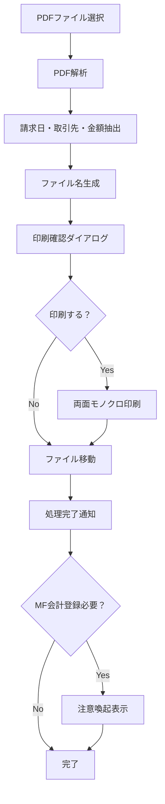

# PDF請求書自動処理システム

PDF形式の請求書を自動で解析・リネーム・印刷・移動するmacOS用ツール

## 概要

このシステムは以下の処理を自動化します：

1. **PDF解析**: 請求書から発行日・取引先・金額を自動抽出
2. **リネーム**: `YYYYMMDD-{取引先}-{金額}.pdf` 形式に統一
3. **印刷確認**: ダイアログで印刷要否を選択（両面・モノクロ設定）
4. **ファイル移動**: 指定フォルダに自動移動
5. **通知**: 処理完了とMF会計手動登録が必要な場合の注意喚起

## 特徴

- ✅ **複数の請求書形式に対応**: Amazon、ダイワボウ情報システム等
- ✅ **印刷機能**: 両面印刷・モノクロ設定対応
- ✅ **Google Drive連携**: クラウドストレージに直接保存
- ✅ **拡張可能**: 新しい取引先フォーマットの追加が容易
- ✅ **右クリック統合**: Finder/PathFinder から直接実行

## 必要環境

- macOS 10.14 以降
- Python 3.9 以降
- Automator（macOS標準）

## インストール

### 1. 必要ライブラリのインストール

```bash
pip3 install pdfplumber
```

### 2. スクリプトファイルの配置

```bash
# スクリプト保存用ディレクトリを作成
mkdir -p ~/scripts

# invoice_processor.py を ~/scripts/ にダウンロード・配置
# 実行権限を付与
chmod +x ~/scripts/invoice_processor.py
```

### 3. 設定ファイルの編集

`invoice_processor.py` 内の以下の設定を環境に合わせて変更：

```python
# 移動先パス（例：Google Drive共有フォルダ）
DEST_FOLDER = "/Users/[USERNAME]/Library/CloudStorage/GoogleDrive-[EMAIL]/共有ドライブ/経理/請求書/"

# 取引先名変換ルール
COMPANY_MAPPING = {
    "Amazon": "amazon",
    "アマゾン": "amazon", 
    "アマゾンジャパン": "amazon",
    "ダイワボウ情報システム": "daiwabo",
    "ヨドバシカメラ": "yodobashi",
    "楽天": "rakuten",
    # 必要に応じて追加
}

# MF会計手動登録が必要な会社
MANUAL_ACCOUNTING = ["daiwabo"]
```

## Automator設定

### アプリケーション形式（推奨）

1. **Automator** を起動
2. **新規書類** → **アプリケーション** を選択
3. **「選択されたFinder項目を取得」** をドラッグ
4. **「シェルスクリプトを実行」** をドラッグ
5. 設定：
   - **シェル**: `/bin/bash`
   - **入力の引き渡し方法**: 引数として
   - **スクリプト**:
   ```bash
   /usr/bin/python3 ~/scripts/invoice_processor.py "$@"
   ```
6. **アプリケーション** として保存（例：`請求書リネーム処理.app`）

### サービス形式（右クリックメニュー）

1. **Automator** を起動
2. **新規書類** → **クイックアクション** を選択
3. 設定：
   - **ワークフローが受け取る現在の項目**: ファイルまたはフォルダ
   - **検索対象**: Finder
4. **「シェルスクリプトを実行」** をドラッグ
5. 設定：
   - **シェル**: `/bin/bash`
   - **入力の引き渡し方法**: 引数として
   - **スクリプト**:
   ```bash
   /usr/bin/python3 ~/scripts/invoice_processor.py "$@"
   ```
6. サービスとして保存（例：`請求書リネーム処理`）

## 使用方法

### アプリケーション形式
1. FinderでPDFファイルを選択
2. `請求書リネーム処理.app` にドラッグ&ドロップ

### サービス形式
1. FinderでPDFファイルを右クリック
2. **サービス** → **請求書リネーム処理** を選択

## 処理フロー



## 対応フォーマット

現在対応している請求書形式：

- **Amazon** / アマゾンジャパン
- **ダイワボウ情報システム**
- **ヨドバシカメラ**
- **楽天**
- **サンテレホン**

### 新しいフォーマットの追加

1. `COMPANY_MAPPING` に取引先を追加
2. 必要に応じて金額抽出パターンを `amount_patterns` に追加
3. テスト実行で動作確認

## トラブルシューティング

### よくある問題

#### 1. `ModuleNotFoundError: No module named 'pdfplumber'`
```bash
# 正しいPythonパスでインストール
/usr/bin/python3 -m pip install pdfplumber
```

#### 2. ファイル移動エラー
- 移動先フォルダのパスが正しいか確認
- Google Driveが正常にマウントされているか確認
- フォルダの書き込み権限を確認

#### 3. 印刷できない
- プリンターが正常に設定されているか確認
- `lpr` コマンドが利用可能か確認

#### 4. 右クリックメニューに表示されない
```bash
# Finderを再起動
killall Finder
```

### デバッグ方法

ターミナルから直接実行してエラー内容を確認：

```bash
/usr/bin/python3 ~/scripts/invoice_processor.py "/path/to/invoice.pdf"
```

## カスタマイズ

### 印刷設定の変更

`print_pdf()` 関数内の `lpr` コマンドオプションを変更：

```python
cmd = [
    "lpr",
    "-o", "sides=two-sided-long-edge",  # 両面印刷
    "-o", "ColorModel=Gray",            # モノクロ
    "-o", "media=A4",                   # 用紙サイズ
    pdf_path
]
```

### 金額抽出パターンの追加

新しい請求書形式に対応する場合、`amount_patterns` に正規表現を追加：

```python
amount_patterns = [
    # 既存パターン...
    r'新しいパターン[\s:：]*([0-9,]+)',  # 新規追加
]
```

## ライセンス

MIT License

## 貢献

プルリクエストやイシューの報告を歓迎します。新しい請求書フォーマットへの対応も含めて、お気軽にご提案ください。

## 開発者より

このプロジェクトは初めてのGitHub公開です。北海道で小さなIT会社を経営しており、日々の請求書処理を効率化するために作成したツールをClaude codeで作成しました。

- バグや改善点があればIssuesでお知らせください
- 新しい請求書フォーマットへの対応も歓迎します
- コードの改善提案もお待ちしています

不慣れな部分はあるかと思いますがよろしくお願いいたします

## 関連リンク

- [pdfplumber documentation](https://github.com/jsvine/pdfplumber)
- [macOS Automator User Guide](https://support.apple.com/guide/automator/)
